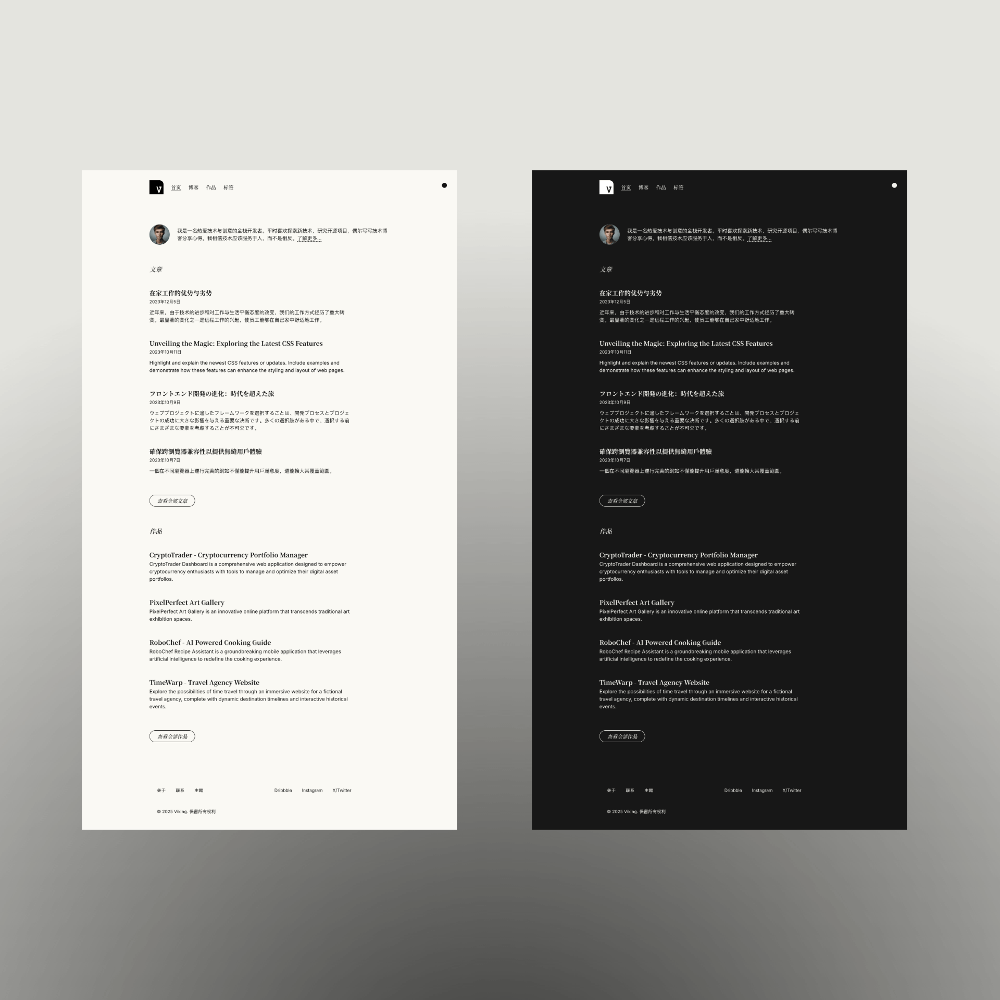
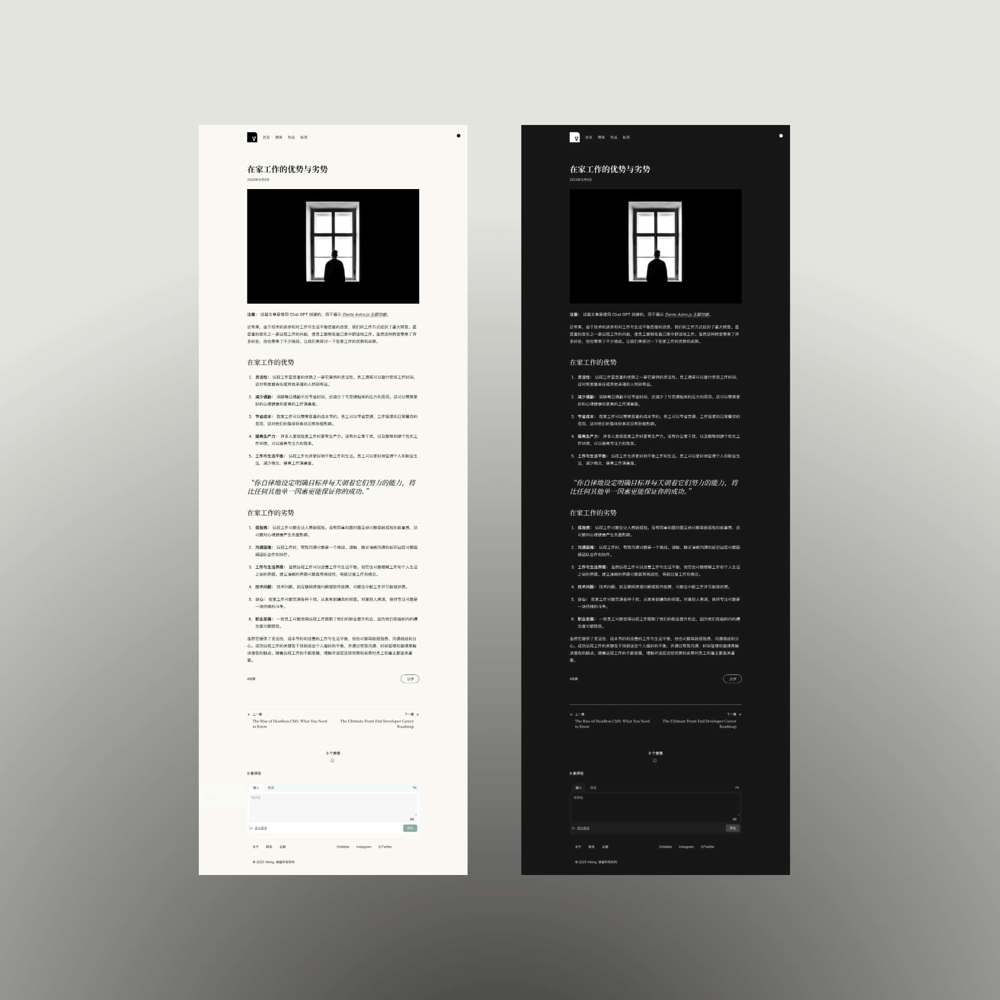

# Viking - Enhanced Astro & Tailwind CSS Theme

A fork of Dante, a single-author blog and portfolio theme for Astro.js, with additional features and improvements. Original theme by [@JustGoodUI](https://justgoodui.com/).

Featuring a minimal, slick, responsive and content-focused design with enhanced multilingual support and more.





## Theme Features:

- ✅ Dark and light color mode
- ✅ Hero section with bio
- ✅ Portfolio collection
- ✅ Pagination support
- ✅ Post tags support
- ✅ Subscription form
- ✅ View transitions
- ✅ Tailwind CSS
- ✅ Mobile-first responsive layout
- ✅ SEO-friendly with canonical URLs and OpenGraph data
- ✅ Sitemap support
- ✅ RSS Feed support
- ✅ Markdown & MDX support

## Additional Features in this Fork:

- ✅ Multilingual support
- ✅ Giscus comment system integration
- ✅ Noto Serif SC font for better multi-language support
- ✅ Chinese-friendly slugify function (converts Chinese characters to pinyin)
- ✅ Redesigned Hero section with a more concise layout

## Configuration

### Setting the Language

Viking supports multiple languages out of the box. You can set your preferred language in the `src/data/site-config.ts` file:

```typescript
const locale = 'zh-CN'; // Your blog's default language
```

Currently supported languages:
- `en-US` (English)
- `zh-CN` (Simplified Chinese)
- `zh-TW` (Traditional Chinese)
- `ja-JP` (Japanese)

The language setting affects all UI elements, including navigation, buttons, and other interface text. Content in your blog posts and projects should be written in your target language.

### Setting up Giscus Comments

Viking comes with [Giscus](https://giscus.app/) integration for comments. To set it up:

1. Go to [https://giscus.app/](https://giscus.app/) and follow the instructions to set up Giscus for your repository
2. Update the Giscus configuration in `src/data/site-config.ts`:

```typescript
giscus: {
    repo: 'yourusername/yourrepo',
    repoId: 'YOUR_REPO_ID',
    category: 'Blog Post Comments',
    categoryId: 'YOUR_CATEGORY_ID',
    mapping: 'pathname',
    strict: '0',
    reactionsEnabled: '1',
    emitMetadata: '0',
    inputPosition: 'bottom',
}
```

Replace the values with those provided by the Giscus setup page. The comments section will automatically appear at the bottom of your blog posts.

## Project Structure

Inside of Viking Astro theme, you'll see the following folders and files:

```text
├── public/
├── src/
│   ├── components/
│   ├── content/
│   ├── data/
│   ├── icons/
│   ├── layouts/
│   ├── pages/
│   ├── styles/
│   └── utils/
├── astro.config.mjs
├── package.json
├── README.md
├── tailwind.config.cjs
└── tsconfig.json
```

Astro looks for `.astro` or `.md` files in the `src/pages/` directory. Each page is exposed as a route based on its file name.

There's nothing special about `src/components/`, but that's where we like to put any Astro (`.astro`) components.

The `src/content/` directory contains "collections" of related Markdown and MDX documents. Use `getCollection()` to retrieve posts from `src/content/blog/`, and type-check your frontmatter using an optional schema. See [Astro's Content Collections docs](https://docs.astro.build/en/guides/content-collections/) to learn more.

Any static assets, like images, can be placed in the `public/` directory.

## Astro.js Commands

All commands are run from the root of the project, from a terminal:

| Command                   | Action                                           |
| :------------------------ | :----------------------------------------------- |
| `npm install`             | Installs dependencies                            |
| `npm run dev`             | Starts local dev server at `localhost:4321`      |
| `npm run build`           | Build your production site to `./dist/`          |
| `npm run preview`         | Preview your build locally, before deploying     |
| `npm run astro ...`       | Run CLI commands like `astro add`, `astro check` |
| `npm run astro -- --help` | Get help using the Astro CLI                     |


## Credits

- Original theme by [Just Good UI](https://justgoodui.com/)
- Demo content generate with [Chat GPT](https://chat.openai.com/)
- Images for demo content from [Unsplash](https://unsplash.com/)


## License

Licensed under the [GPL-3.0](https://github.com/JustGoodUI/dante-astro-theme/blob/main/LICENSE) license.
